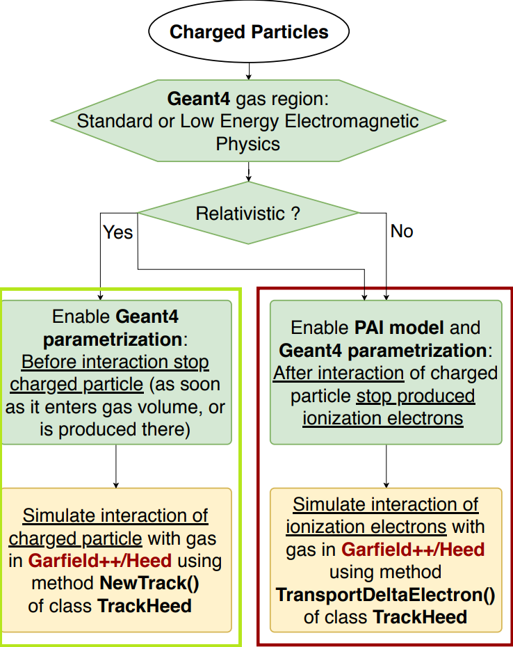
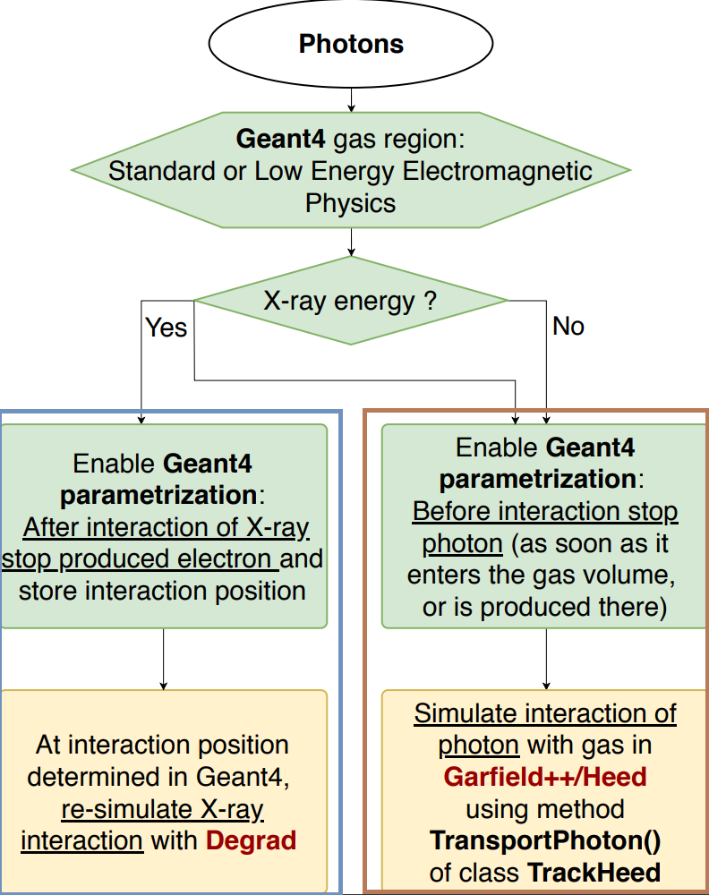
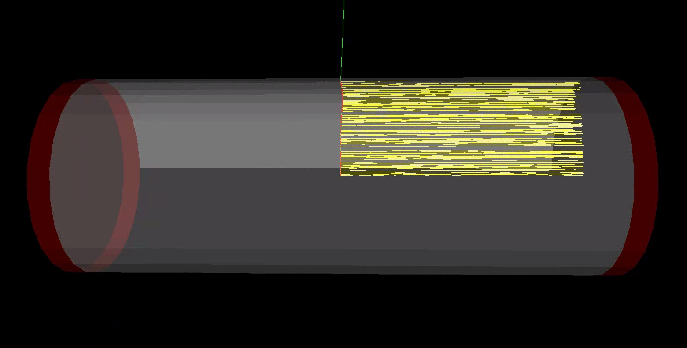
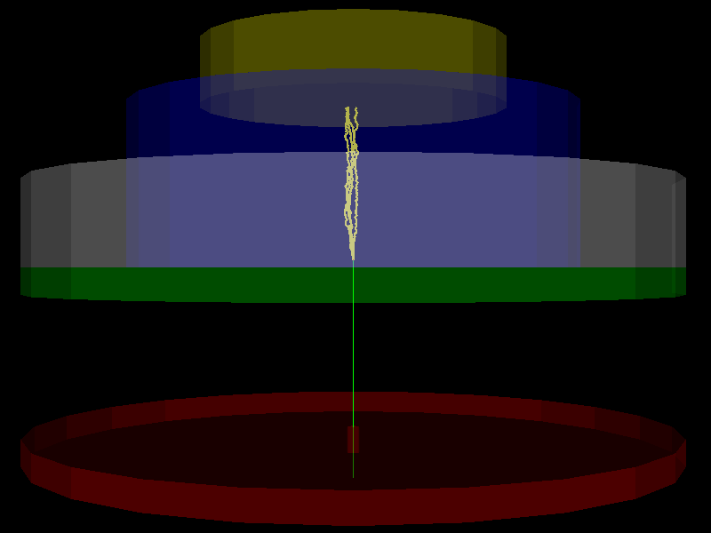

Project scope
===============

This documentation page shows how to implement an interface between Geant4 and Garfield++/Degrad for the simulation of a gas-based detector. A general overview of the applied strategy for charged particles and photons is shown in the flow charts below. 

The project handles two ways to interface Geant4 with Garfield++ for the simulation of charged particles: The first method, marked in green, immediately kills the particle as soon as it either enters the gas region or is created there. Next, it is transferred to Garfield++ where it is tracked by the *NewTrack*-method of the class *TrackHeed*. The user should keep in mind that this routine is only valid for relativistic particles, as *NewTrack* does not take into account coulomb scattering. The second method, marked in red, tracks the primary particle in the gas region with Geant4, until the energy drops below a certain threshold set by the user. At this moment Garfield++ takes over, and the particle is tracked by the *TransportDeltaElectron*-method, which is also a member of the *TrackHeed*-class. Here, it is important to notice that *TransportDeltaElectron* only works for energies below approximately 100 keV. Therefore, the user should set a threshold value which is lower. As it is shown in the paper_, in most cases a value of a few keV is found to be optimal. This method can be used for any energy and any type of charged particle.

.. _paper: https://arxiv.org/abs/1806.05880

.. _chargedParticles:

   charged particles

In addition, this project supports two routines to handle photons: The first one, marked in brown, follows a similar approach as the second method for charged particles. The user provides an energy range, for which the photon should be sent to Garfield++, where it is tracked by the *TransportPhoton*-method (*TrackHeed*). If the photon's energy is not within this range, it is tracked by the applied Geant4 physics list. The second routine, marked in blue, uses Degrad and should only be applied for X-ray energies. When the X-ray enters the gas region, it can interact with the medium through three main processes: photo-electric absorption, compton scattering and pair production. As soon as one of these processes occurs, the so-created particles are killed and the interaction location is saved. Next, Degrad is used to re-simulate the interaction, as it is much more detailed and accurate than Geant4 with respect to the subsequent cascade processes like Auger, Coster-Kronig and recombination. Subsequently, the so-created electrons are transferred back to Geant4, where they can be further tracked, internally or by any of the interfacing methods for charged particles described above.

.. _photons:

   photons

To clarify what the scope is of the interface and to illustrate the strength of it, the project involves two user cases: a TPC with charged readout and an optical TPC. 

The first one uses the setup from the ALICE TPC and generally follows the online example from the Garfield_ webpage. Here, both low-energy and high-energy charged particles can be tracked in the TPC volume, as well as the subsequently created ionisation electrons. These secondary electrons are drifted towards one side of the tube by an electric field created by two high voltage electrode planes located at the end caps. Near the end caps, a grid of wires is placed to accelerate the electrons in order to create an ion avalanche that will produce a signal on the readout pads. The latter is not implemented in the interface, since the example merely serves as a proof of principle, although this shouldn't be too complicated. The detector setup for this user-case is shown below. The green line represents a 1 MeV electron fired radially from the center of the tube, the red dots correspond to the locations of ionization and the yellow lines show the electron drift trajectories. The end caps are also marked in red.

.. _Garfield: http://garfieldpp.web.cern.ch/garfieldpp/examples/alicetpc/

.. _alicetpc:

   ALICE TPC

The second user-case is an optical TPC, based on a Xenon gas. More specifically, in this setup a 5.9 keV X-ray from Fe-55 is fired though an entrance window at a volume filled with Xenon-gas. When the X-ray enters the gas volume it will most often interact with Xenon via the photo-electric effect.The goal is to simulate the light collection on the photo cathode placed above the gas volume, where the optical photons are created by the drifting electrons that were produced by the photo-electric interaction of the X-ray with the gas. A more detailed explanation can be found in the paper. Setup is shown in the figure below: The two disks in red and green are collimators, the grey tube is the ceramic wall surrounding the gas volume (in blue), and the yellow disk on top is the photocathode.

.. _opticaltpc:

   optical TPC
